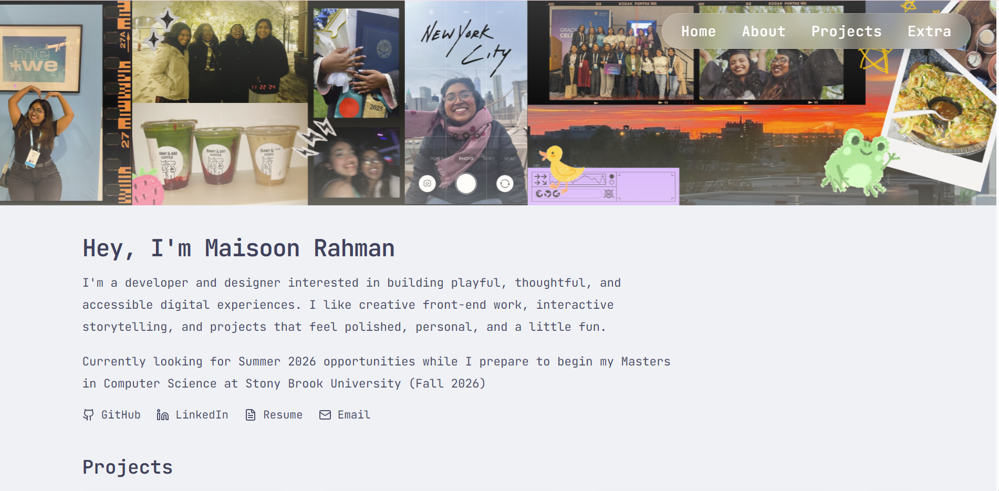

# ✨ Maisoon's Portfolio

  

  Click the image to visit the live site

---

## 🧠 About

This is my personal portfolio website built to showcase my work in **frontend development, UI/UX design, and creative coding**.

The site is designed as an interactive experience, blending **minimalist design with playful elements and widgets** to reflect both my technical and creative interests.

---

## ⚙️ Tech Stack

- **React + Vite**
- **JavaScript (ES6+)**
- **HTML5 / CSS3**
- **Tailwind CSS**
- **Framer Motion**
- **GitHub Actions (CI/CD deployment)**

---

## 🎨 Features

- 🎞️ Animated hero banner (“memory reel” concept)
- 🧩 Modular card-based UI system
- 🌗 Light/Dark theme toggle (Catppuccin-inspired)
- 🎵 Embedded Spotify playlist
- 📱 Fully responsive layout
- ⚡ Deployed via GitHub Pages

---

🌐 Deployment

This project is deployed using GitHub Actions + GitHub Pages.

---

## 📌 Notes

This portfolio is continuously evolving as I explore new ideas in:
- UI/UX design
- Interactive web experiences
- Game-inspired interfaces
